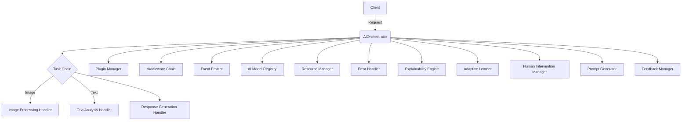
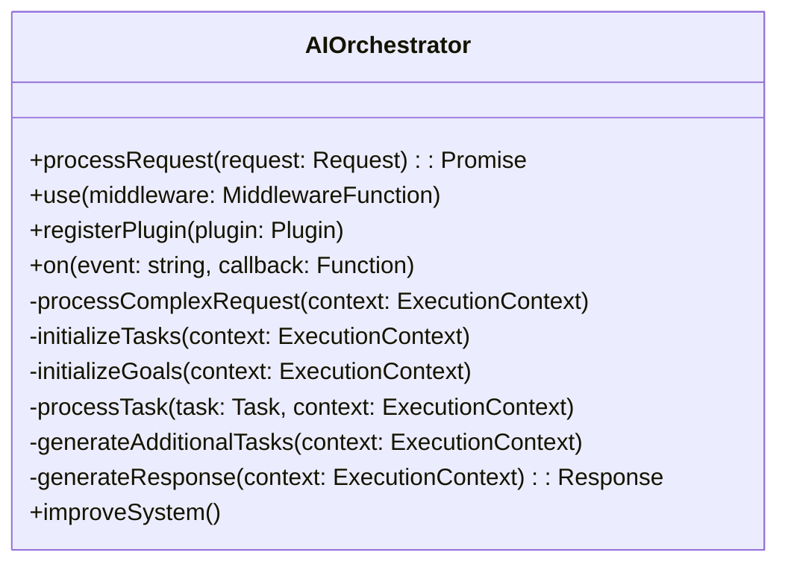
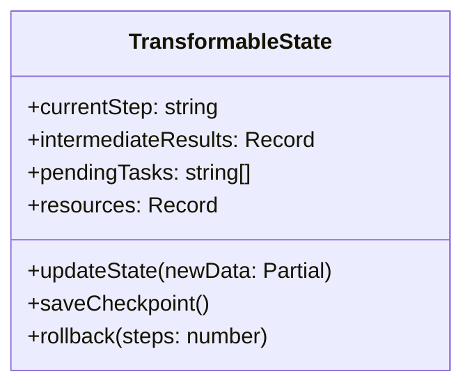
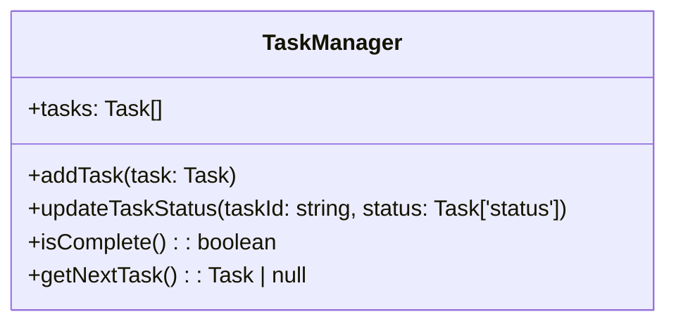
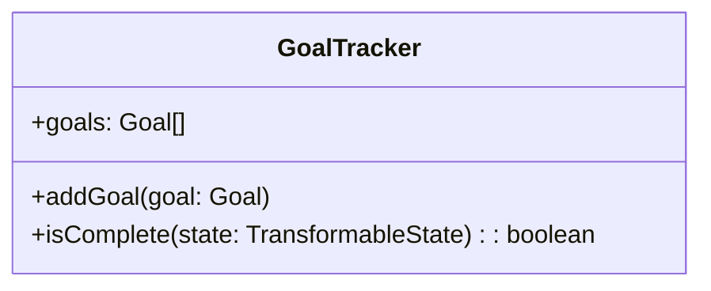
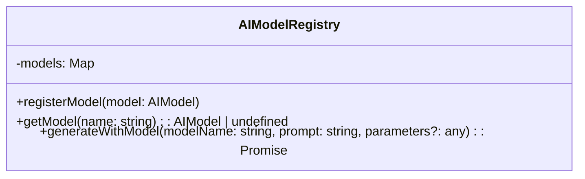
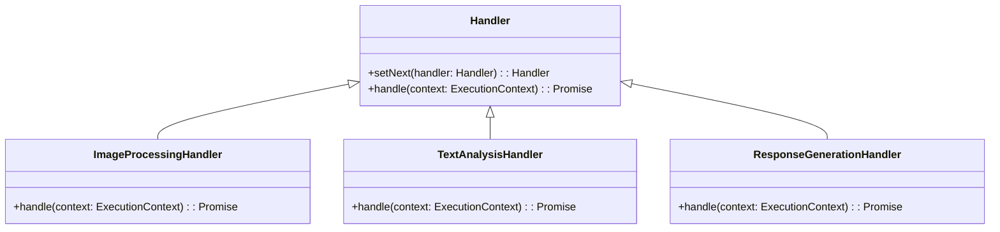
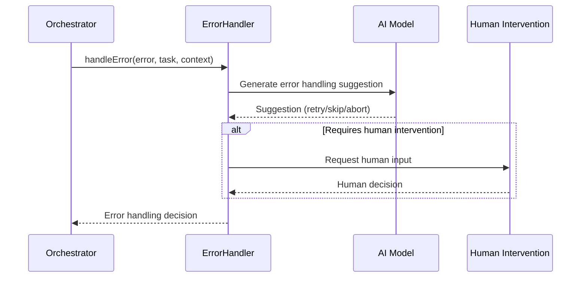
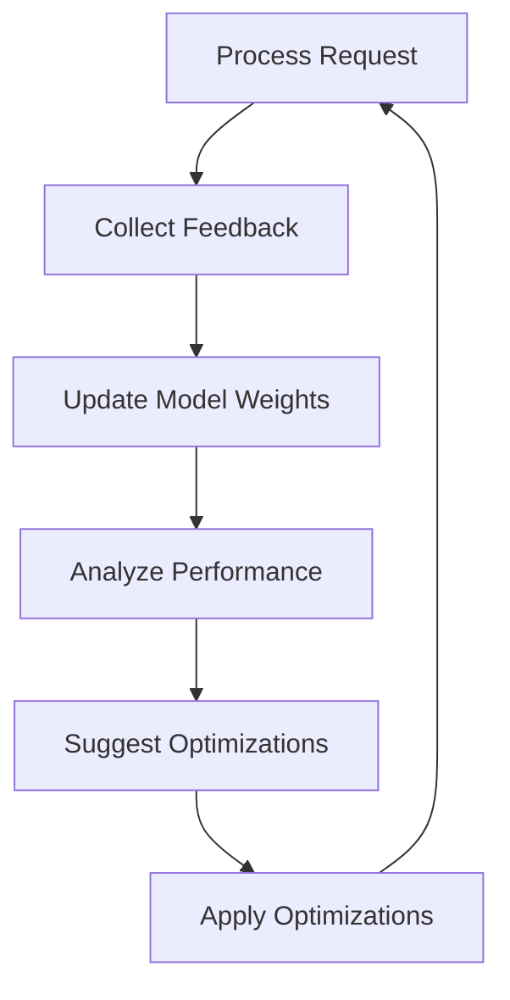

# AI Orchestration Framework Documentation

## Table of Contents

1. [Introduction](#introduction)
2. [Architecture Overview](#architecture-overview)
3. [Core Components](#core-components)
4. [Utility Classes](#utility-classes)
5. [Handlers](#handlers)
6. [Plugins and Middleware](#plugins-and-middleware)
7. [Usage Example](#usage-example)
8. [Advanced Topics](#advanced-topics)
9. [API Reference](#api-reference)

## 1. Introduction

The AI Orchestration Framework is a modular and extensible system designed to manage complex AI workflows. It provides a structured approach to handling requests, coordinating multiple AI models, and managing the lifecycle of AI tasks.

## 2. Architecture Overview



The AIOrchestrator is the central component that coordinates all aspects of request processing. It utilizes various components to handle different aspects of the AI workflow.

## 3. Core Components

### 3.1 AIOrchestrator

The AIOrchestrator is the main class that coordinates the entire request processing workflow.



### 3.2 Session

The Session class represents a single interaction session, maintaining state and history.

```mermaid
classDiagram
    class Session {
        +id: string
        +history: Array<{request: Request, response: Response}>
        +state: TransformableState
        +activeModels: string[]
        +addInteraction(request: Request, response: Response)
        +updateState(newState: Partial<TransformableState>)
    }
```

### 3.3 TransformableState

TransformableState represents the evolving state of a complex request.



## 4. Utility Classes

### 4.1 TaskManager

Manages the lifecycle of tasks within a request.



### 4.2 GoalTracker

Tracks the goals of a request and checks for their completion.



### 4.3 AIModelRegistry

Manages the available AI models and their execution.



## 5. Handlers

Handlers are responsible for processing specific types of tasks in the task chain.



## 6. Plugins and Middleware

Plugins and middleware allow for easy extension of the framework's functionality.

### 6.1 Plugin Example

```typescript
const loggingPlugin: Plugin = {
  name: 'LoggingPlugin',
  initialize: (orchestrator) => {
    orchestrator.on('requestStart', (context) => {
      console.log('Request started:', context.request.id);
    });
  },
  hooks: {
    preProcess: async (context) => {
      console.log('Pre-processing request:', context.request.id);
    },
    postProcess: async (context) => {
      console.log('Post-processing request:', context.request.id);
    }
  }
};

orchestrator.registerPlugin(loggingPlugin);
```

### 6.2 Middleware Example

```typescript
orchestrator.use(async (context, next) => {
  console.log('Request received:', context.request.id);
  await next();
  console.log('Response sent:', context.response?.id);
});
```

## 7. Usage Example

Here's a complete example of how to use the AI Orchestration Framework:

```typescript
import { AIOrchestrator } from './AIOrchestrator';
import { ImageProcessingHandler } from './handlers/ImageProcessingHandler';
import { TextAnalysisHandler } from './handlers/TextAnalysisHandler';
import { ResponseGenerationHandler } from './handlers/ResponseGenerationHandler';
import { Request } from './core/types';

async function main() {
  const orchestrator = new AIOrchestrator();

  // Set up the task chain
  const imageHandler = new ImageProcessingHandler();
  const textHandler = new TextAnalysisHandler();
  const responseHandler = new ResponseGenerationHandler();
  orchestrator.taskChain = imageHandler;
  imageHandler.setNext(textHandler).setNext(responseHandler);

  // Register a plugin
  orchestrator.registerPlugin({
    name: 'LoggingPlugin',
    initialize: (orch) => {
      orch.on('requestStart', (context) => {
        console.log('Request started:', context.request.id);
      });
    },
    hooks: {
      preProcess: async (context) => {
        console.log('Pre-processing request:', context.request.id);
      },
      postProcess: async (context) => {
        console.log('Post-processing request:', context.request.id);
      }
    }
  });

  // Add middleware
  orchestrator.use(async (context, next) => {
    console.log('Middleware: Request received');
    await next();
    console.log('Middleware: Response sent');
  });

  // Process a request
  const request: Request = {
    id: `request-${Date.now()}`,
    type: 'image',
    input: 'base64encodedimage',
    metadata: {
      timestamp: new Date(),
      userId: 'user123'
    }
  };

  try {
    const response = await orchestrator.processRequest(request);
    console.log('Response:', response);
  } catch (error) {
    console.error('Error processing request:', error);
  }

  // Improve the system
  await orchestrator.improveSystem();
}

main().catch(console.error);
```

## 8. Advanced Topics

### 8.1 Error Handling

The framework includes an ErrorHandler class that manages errors during task execution:



### 8.2 Adaptive Learning

The AdaptiveLearner class allows the system to improve over time:



## 9. API Reference

### 9.1 AIOrchestrator

- `processRequest(request: Request): Promise<Response>`
- `use(middleware: MiddlewareFunction): void`
- `registerPlugin(plugin: Plugin): void`
- `on(event: string, callback: Function): void`
- `improveSystem(): Promise<void>`

### 9.2 Session

- `addInteraction(request: Request, response: Response): void`
- `updateState(newState: Partial<TransformableState>): void`

### 9.3 TransformableState

- `updateState(newData: Partial<TransformableState>): void`
- `saveCheckpoint(): void`
- `rollback(steps: number): void`

### 9.4 TaskManager

- `addTask(task: Task): void`
- `updateTaskStatus(taskId: string, status: Task['status']): void`
- `isComplete(): boolean`
- `getNextTask(): Task | null`

### 9.5 GoalTracker

- `addGoal(goal: Goal): void`
- `isComplete(state: TransformableState): boolean`

### 9.6 AIModelRegistry

- `registerModel(model: AIModel): void`
- `getModel(name: string): AIModel | undefined`
- `generateWithModel(modelName: string, prompt: string, parameters?: any): Promise<string>`